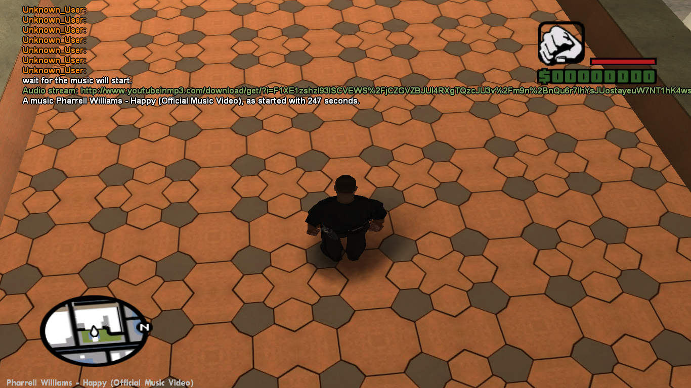

# SAMP youtube-stream
Include to allow you reproduce an youtube url

|  Total downloads | Latest release |
| :---: | :---: | 
  |       |  

## Configuration
| Definition | Action |
|:----------:|:------:|
| YOUTUBE_USE_TEXTDRAW | Active the textdraw info with name of stream [see](#image-with-stream-name)|
| USE_REGEX | Active the function IsValidYoutubeUrl|

## Callbacks
* [OnPlayYoutubeUrl](#onplayyoutubeurl)
* [OnFinishYoutubeUrl](#onfinishyoutubeurl)

## Functions
* [IsValidYoutubeUrl](#isvalidyoutubeurl)
* [ConvertYoutubeUrl](#convertyoutubeurl)
* [PlayYoutubeStreamForPlayer](#playyoutubestreamforplayer)
* [StopYoutubeStreamForPlayer](#stopyoutubestreamforplayer)
* [GetYoutubeStreamTitle](#getyoutubestreamtitle)
* [GetYoutubeStreamLen](#getyoutubestreamlen)
* [GetYoutubeStreamPosX](#getyoutubestreamposx)
* [GetYoutubeStreamPosY](#getyoutubestreamposy)
* [GetYoutubeStreamPosZ](#getyoutubestreamposz)
* [GetYoutubeStreamDistance](#getyoutubestreamdistance)
* [IsYoutubeStreamUsePos](#isyoutubestreamusepos)

## Image with stream name

## Callbacks documentation

#### OnPlayYoutubeUrl
> Called when youtube url an played.
>* **Parameters:**
>	* `playerid`: The playerid 
>	* `title`: The title of url(if invalid \0) 
>	* `len`: The length of url(if invalid 0) 
>	* `response`: The response of url
>
> * Response codes:
> * 1 Sucess
> * -1 Invalid url
> * -2 Invalid page

***

#### OnFinishYoutubeUrl
> Called when youtube url as finished.
>* **Parameters:**
>	* `playerid`: The playerid 
>	* `title`: The title of url
>	* `len`: The length of url

## Function documentation

#### IsValidYoutubeUrl
> Determines if valid youtube url.
>* **Parameters:**
>	* `url`: The url
>* **Returns:**
>	* True if is a valid url, false not.

***

#### ConvertYoutubeUrl
> Converts an youtu.be url to youtube.com
>* **Parameters:**
>	* `Url`: The url to convert
>	* `size`: The size
>* **Returns:**
> True on convert have sucess, false not.

***

#### PlayYoutubeStreamForPlayer
> Play an youtube 'audio stream' for a player.
>* **Parameters:**
>	* `playerid`: The ID of the player to play the audio for.
>	* `url`: The url to play.
>	* `posX`: The X position at which to play the audio. Default 0.0. Has no effect unless usepos is set to 1.
>	* `posY`: The Y position at which to play the audio. Default 0.0. Has no effect unless usepos is set to 1.
>	* `posZ`: The Z position at which to play the audio. Default 0.0. Has no effect unless usepos is set to 1.
>	* `distance`: The distance over which the audio will be heard. Has no effect unless usepos is set to 1.
>	* `usepos`: Use the positions and distance specified. Default disabled (0).
>* **Returns:**
>	* True on sucess, or false on failure. if USE_REGEX active is more efficient

***

#### StopYoutubeStreamForPlayer
> Stop an youtube 'audio stream' for a player.
>* **Parameters:**
>	* `playerid`: The ID of the player to stop the audio for.
>* **Returns:**
>	* True on sucess, or false on failure.

***

#### GetYoutubeStreamTitle
> Gets the youtube stream title.
>* **Parameters:**
>	* `playerid`: The playerid
>	* `dest`: The destination
>	* `size`: The size
>* **Returns:**
>	* 1 on sucess, 0 on fails

***

#### GetYoutubeStreamLen
> Gets the youtube stream length.
>* **Parameters:**
>	* `playerid`: The playerid
>* **Returns:**
>	* The length of stream

***

#### GetYoutubeStreamPosX
> Gets the youtube stream position x.
>* **Parameters:**
>	* `playerid`: The playerid
>* **Returns:**
>	* The position x

***

#### GetYoutubeStreamPosY
> Gets the youtube stream position y.
>* **Parameters:**
>	* `playerid`: The playerid
>* **Returns:**
>	* The position y

***

#### GetYoutubeStreamPosZ
> Gets the youtube stream position z.
>* **Parameters:**
>	* `playerid`: The playerid
>* **Returns:**
>	* The position z

***

#### GetYoutubeStreamDistance
> Gets the youtube stream distance.
>* **Parameters:**
>	* `playerid`: The playerid
>* **Returns:**
>	* The stream distance

***

#### IsYoutubeStreamUsePos
> Determines if youtube stream use position.
>* **Parameters:**
>	* `playerid`: The playerid
>* **Returns:**
>	* The usepos

***